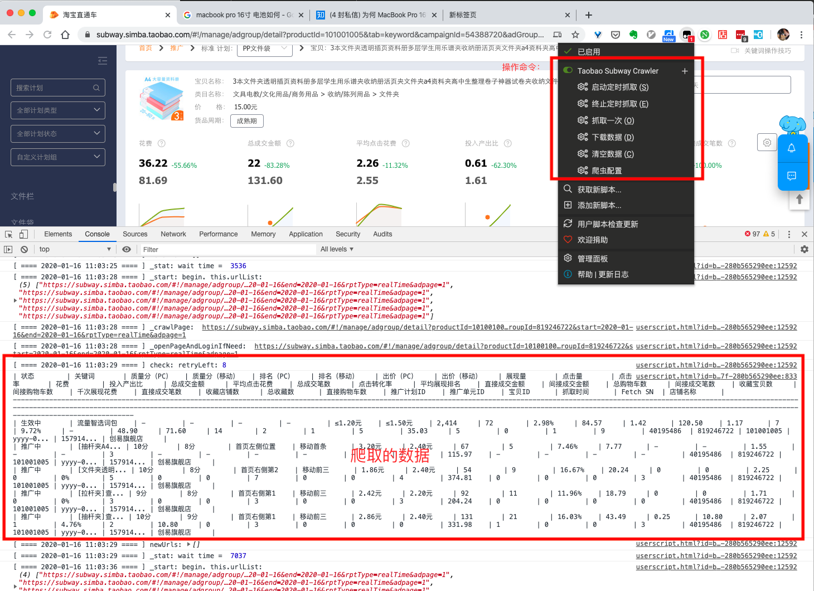

# crawler-userscript
一个基于 Tampermonkey 插件平台开发的爬虫。主要目的是最大限度模拟用户环境，避免被反爬虫系统识破。



# 为什么在 Tampermonkey 上写爬虫？

1. **接口足够开发爬虫**。Tampermonkey 是一个跨浏览器的扩展平台，通常写一个爬虫所需要调用的底层接口，浏览器扩展程序都提供了。
2. **不会被反爬虫系统封印**。用浏览器扩展，可以最大程度的模拟用户真是行为，避免被烦爬虫系统发现。比如，如果用 selenium 来登陆淘宝，浏览器会留下一些记号，比如 `window.navigator.webdriver = true`，淘宝就能发现而阻止其登陆。后来，有各种大神想各种办法绕过淘宝网站的检测，但是过不了几个月，总是又被淘宝堵住漏洞。所以，selenium 不是长久之际，浏览器扩展才是一劳永逸的解决方法，因为淘宝不可能仅仅因为你装了扩展就阻止你登陆。

# 安装

还没有时间把这个爬虫库做成一个第三方库，大家可以直接`clone`代码来运行。

下载代码：
```sh
git clone https://github.com/zjh1943/crawler-userscript.git
```

安装依赖库：
```sh
cd {project_root}
npm i 
```

构建并启动服务：
```sh
npm run dev
```
这里会将构建好的`userscript`文件存储在`{project_root}/dist`文件夹，然后启动一个端口为 9001 的 HTTP 服务。

* 如果要在 Tampermonkey 中安装脚本，则可以直接将 `{project_root}/dist/ant.user.js`文件内容拷贝过去即可。
* 如果在写代码时需要更新以调试，则在 Tampermonkey 中设置脚本更新地址为：`https://localhost:9001/dist/ant.user.js` 即可。这样每次点击「检查更新」，就会自动更新最新的代码。

# 爬虫使用方法

```js
const Crawler = require('./crawler.js');
crawler = new Crawler({
    startPageURL: 'https://subway.simba.taobao.com/#!/manage/campaign/index', // 启动地址
    gotoUrl: async (url) => { location.href = url }, // 跳转链接的方法。Crawler 是一个纯 JS 库，你可以自由选择跳转方式。
    pageList: [ // pageList 是一个列表，列表中每一项代表一组有相同结构的网页。
        {
            id: 'keywordsList',
            triggerOnUrl: (url) => {
                // 当前配置项所适用的网页
                return !!url && !!url.match(/(https:\/\/subway.simba.taobao.com)?\/?(#\!\/manage\/adgroup\/detail)(.*)/;
            },
            onPageReady: async () => {
                // 网页已经加载完，在这里提取想要的数据，选择合适的方式保存数据。
            },
            getUrlsToAdd: () => {
                // 从当前网页中找出需要加入爬虫队列的新的链接。
                return urls;
            },
            // 判断网页是否已经抓取完。
            isPageReady: () => $('.table-td .bp-table tr').length > 0,

        },
        // 此处可以增加多个待爬取页面，每一个都跟上面的配置类似，不再赘述。
        ...
    ],
}

crawler.start();
```


# 更多配置项

```js
const Crawler = require('./crawler.js');

crawler = new Crawler({
    startPageURL: 'https://subway.simba.taobao.com/#!/manage/campaign/index', // 启动地址
    minWait: 3000,
    maxWait: 5000,
    gotoUrl: async (url) => { location.href = url },
    pageList: [ // pageList 是一个列表，列表中每一项代表一组有相同结构的网页。
        {
            id: 'keywordsList',
            triggerOnUrl: (url) => {
                // 当前配置项所适用的网页
                return !!url && !!url.match(/(https:\/\/subway.simba.taobao.com)?\/?(#\!\/manage\/adgroup\/detail)(.*)/;
            },
            onPageReady: async () => {
                // 网页已经加载完，在这里提取想要的数据。
            },
            getUrlsToAdd: () => {
                // 从当前网页中找出需要加入爬虫队列的新的链接。
                return urls;
            },
            // 判断网页是否已经抓取完。
            isPageReady: () => $('.table-td .bp-table tr').length > 0,

        },
        // 此处可以增加多个待爬取页面，每一个都跟上面的配置类似，不再赘述。
        ...
    ],
    login: {
        needLogin: true, // 是否需要登陆
        loginPageURL: '', // 登陆地址
        needLogin: () => {
            // 根据网页当前显示的内容，来判断 token 是否已经过期，是否需要登陆。
            return false;
        },
        isLoginSuccess: () => {
            // 根据网页内容，判断是否已经登陆成功。
            return false;
        },
        doLogin: async () => {
            // 执行登陆操作
        },
        isLoginPageReady: () => {
            // 登陆页面是否已经加载完全
            return false;
        }

    }

};)

crawler.start()
    .then(() => {
        // 爬取成功。
    }).catch( (msg) => {
        // 爬取失败
    });


// 停止并清空爬虫队列。
crawler.clear();

// 暂停和恢复。爬虫状态仍然保存。
crawler.pause();
crawler.resume();

```

## 其他

此项目其实是一个完整的项目实例，包括如何配置爬虫、存储数据等。
更多精彩内容可以慢慢看代码。